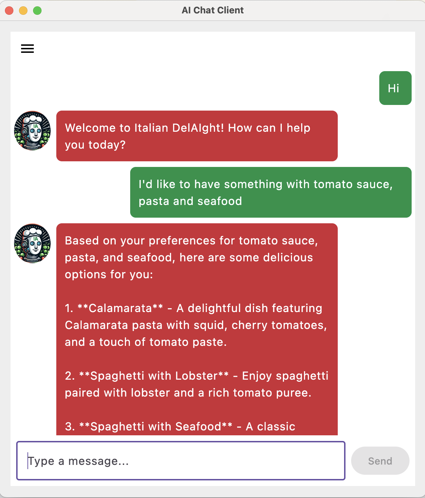
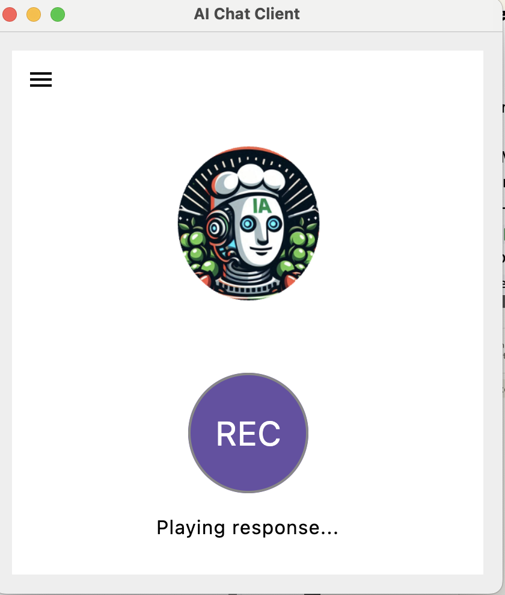
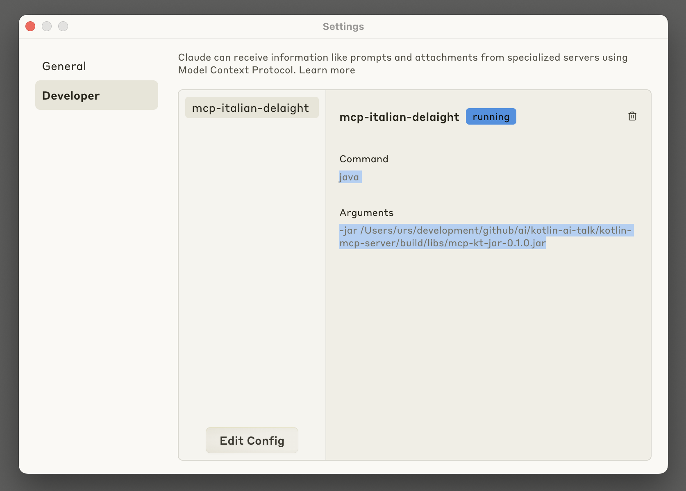
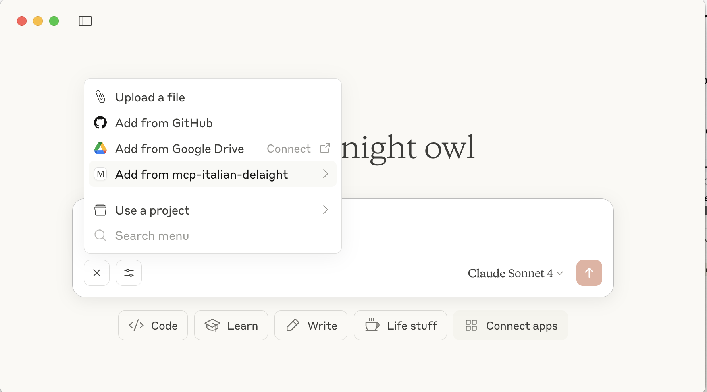

# Sources for KotlinConf 2025 talk 
## From 0 to H-AI-ro: fast track to AI for Kotlin developers.

### Preparations
- Install the Kotlin Notebooks plugin in IntelliJ
- You need an OpenAI API key in your environment: ```OPENAI_API_KEY=<your-key>```

### LangChain4J with Spring Boot in module: `/langchain4j`

#### Run LangChain4J sample application
- Provide the OpenAI key `OPENAI_API_KEY` in the environment
- Run application: [LangChain4JDemoApplication.kt](langchain4j/src/main/kotlin/dev/example/LangChain4JDemoApplication.kt)
- Run Samples in the notebook: [langchain4j-demo.ipynb](langchain4j/langchain4j-demo.ipynb)


#### Play with Embeddings and Similarity
- Run Samples in the notebook: [langchain4j-similarity.ipynb](langchain4j/langchain4j-similarity.ipynb)


#### Data Ingestion
- Start docker-compose: `docker-compose up`
- Open the notebook: [langchain4j-ingest.ipynb](langchain4j/langchain4j-ingest.ipynb)
- Run code snippets to ingest data


### LangChain4J with ktor in module: `/langchain4j-ktor`

#### Run LangChain4J-ktor sample application
- Provide the OpenAI key `OPENAI_API_KEY` in the environment
- Run application: [Application.kt](langchain4j/src/main/kotlin/dev/example/LangChain4JDemoApplication.kt)
- Run Samples in the notebook: [/langchain4j/langchain4j-demo.ipynb](langchain4j/langchain4j-demo.ipynb)


### SpringAI in module: `/spring-ai`

#### Run SpringAI sample application
- Provide the OpenAI key `OPENAI_API_KEY` in the environment
- Start docker-compose: `docker-compose up`
- Run application: [SpringAIDemoApplication.kt](spring-ai/src/main/kotlin/dev/example/SpringAIDemoApplication.kt)
  - The first time it takes a while since the vector db is ingested using the spring-ai way
- Run Samples in the notebook: [spring-ai-demo.ipynb](spring-ai/spring-ai-demo.ipynb)


### Run KMP chat / audio client
- Run KMP Chat Client `main` in  [Main.kt](spring-ai/src/test/kotlin/dev/example/ChatClient.kt) in the `chatclient-kmp` module
- Chat Feature: 
  
  

- Voice Feature:

  


### Kotlin MCP server + integration with Claude Desktop: `/kotlin-mcp-server`
- MCP Server that exposes:
  - **prompt**: similar to system prompt in Spring-AI but tailored for MCP capabilities (resources and tools)
  - **resource**: the menu as MCP resource
  - **tools**: tools to classify, find dishes via vector search and ordering dish, all forwarding to the Spring-AI rest endpoints
- Build the MCP Server with: `./gradlew jar`
- Open the Claude Desktop application -> Settings -> Developer and press `Edit Config` to locate the `claude_desktop_config.json` file.
  
- Add the following configuration in `claude_desktop_config.json`:
  ```{
  "mcpServers": {
     "mcp-italian-delaight": {
      "command": "java",
      "args": ["-jar", "<project-path>/kotlin-mcp-server/build/libs/mcp-kt-jar-0.1.0.jar"]
    }
  }
}```
- Restart Claude Desktop and manually select the `italian-meal-agent` prompt that the MCP server exposes: 
  
- Now you can order your favorite dish. Buon Appetito 🍕🇮🇹🍝! 